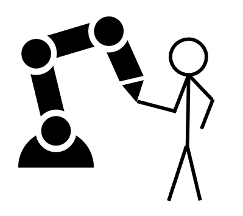

Kinematics is the relationship between the geometry of the robot and its movement in the Cartesian space. We take into account the configuration of the robot and the length of the joints. A configuration describes the state of the robot's parts we have control over. For a robot arm the configuration is the state of the motors - the rotational joints. We can measure how far a motor turned from an initial position. For a robot with three motors we express this with a three dimensional vector q, where each row is the rotation of one of the joints in radiant, e.g. $q = [0.5,0,1]^T$.

One quick note about the notation: In the literature you often find a distinction between the rotation of the motor - $\theta$ - and the rotation of the joint - $q$. Depending on the construction of the robot they might or might not be identical. I will use mainly the rotation of the joint, but don't hesitate to think about an actual motor rotating, because it might be more intuitive for you.

# Chaining Transformations

Back to the main problem: Our goal is to develop a transformation matrix $T(q)_{O,ee}$ which allows us to compute the pose of the end-effector given the configuration of the robot. $T_{O,ee}$ is the transformation from the origin (O) to the end-effector (ee). We know the geometry of the three links and we have sensors which measure the rotation of the three joints. We can express the rotation from each joint plus the translation due to the geometry of the link as a transformation matrix. Additionally, we have the transformation from the origin to the first joint. 

As we learned in the article about [transformation matrices](/transformation) we can chain multiple transformation matrices together and to get the overall transformation from the origin to the tip of the endeffector. For our robot, i.e.

$$T(q)_{O,ee} = T(q_0)_{O,0} \cdot T(q_0)_{0,1} \cdot T(q_0)_{1,2} \cdot T_{2,ee}$$

Each of these transformations are simple rotations and translations depending on the joint angle and the link length.

<iframe src="https://kinematics.robotics-explained.com" title="Robot Kinematics" width="100%" height="500" frameborder="0"></iframe>

# Transformations for each joint

1. Joint 0: This transforamtion is actually quite simple, as we chose the origin of the workspace to be identical with the position of the first joint. We therefore have no translation. The rotation is determind by the rotation of the first joint, $q_0$.

$$
T(q_0)_{O,0}
= \begin{bmatrix}
cos(q_0) & - sin(q_0) & 0 \\
sin(q_0) & cos(q_0) & 0 \\
0 & 0 & 1
\end{bmatrix}
$$

2. Joint 1: Besides the rotation from the joint we have a translation by 150 mm in x-direction.

$$
T(q_1)_{0,1}
= \begin{bmatrix}
cos(q_1) & - sin(q_1) & 0.15 \\
sin(q_1) & cos(q_1) & 0 \\
0 & 0 & 1
\end{bmatrix}
$$

3. Joint 2: This is identical to joint 1

$$
T(q_2)_{1,2}
= \begin{bmatrix}
cos(q_2) & - sin(q_2) & 0.15 \\
sin(q_2) & cos(q_2) & 0 \\
0 & 0 & 1
\end{bmatrix}
$$

4. End-effector: As the tip of the end-effector does not rotate, we have only a translation by 30 mm in x-direction.

$$
T_{2,ee}
= \begin{bmatrix}
1 & 0 & 0.03 \\
0 & 1 & 0 \\
0 & 0 & 1
\end{bmatrix}
$$

By multiplying all these transformation matrices, we get $T(q)_{O,ee}$, the transformation from the origin to the end-effector.

$$
T_{O,ee}
= \begin{bmatrix}
cos(\phi_{O,ee}) & -sin(\phi_{O,ee}) & x_{O,ee} \\
sin(\phi_{O,ee}) & cos(\phi_{O,ee}) & y_{O,ee} \\
0 & 0 & 1
\end{bmatrix}
$$

with

$$\phi_{O,ee} = q_0+q_1+q_2$$

$$x_{O,ee} = 0.15 \cdot cos(q_0) + 0.15 \cdot cos(q_0+q_1) + 0.03 \cdot cos(q_0+q_1+q_2)$$

$$y_{O,ee} = 0.15 \cdot sin(q_0) + 0.15 \cdot sin(q_0+q_1) + 0.03 \cdot sin(q_0+q_1+q_2)$$

The angle of the end-effector with respect to the origin is the sum of the angles of all three joints. You can play around with the interactive demo to validate this finding. The x and y components of the end-effector's position are a bit more complicated, but we can find a certain pattern. For each joint we multiply its length with the cos (or sin for the y-component) of its angle with respect to the origin.

Given the configuration of the robot, we can now compute the Cartesian coordinates of the tip of the end-effector! This is called *forwards kinematics*. Please take a moment to think about what we just achieved with such a transformation! We are now able to understand our robot when we ask where it is, because it is able to translate its inner configuration into a system which has a meaning for us.

>You: "Hey, where are you?"  
>Robot: "I'm at (0.5, 0.1) with a rotation of 0.75. The origin is the center of my first joint"  
>You: "Cool, I will be there in a second"

