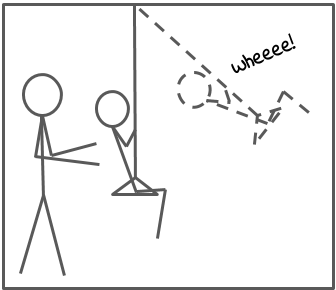
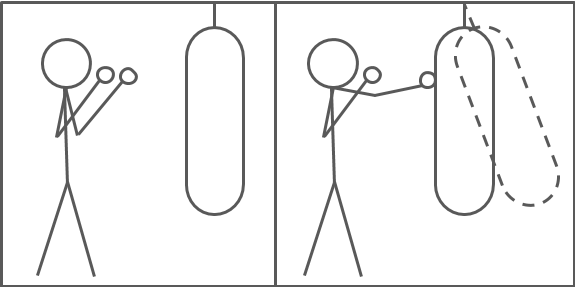
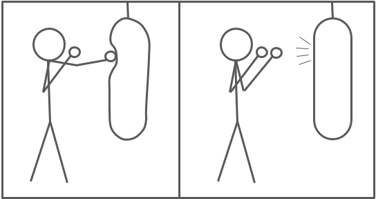
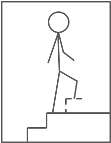

In this chapter I explain what impedance control is about. Whenever robots are mentioned in this article, I have those consisting of links and joints in mind, with end-effectors to manipulate their environment.

# Impedance

Let’s start with the definition of impedance.
Mechanical impedance is a measure how much a structure resists motion when subjected to a (harmonic) force. The inverse of the impedance is admittance. It is the ratio of velocity to force. You can think of pushing a child’s swing with a certain frequency. The lower the admittance of the swing, the more force is necessary to reach the same velocity of the swing. A swing with a very high admittance would just need a tiny little push and the child would swing up to the sky. Wheeee!

So let’s introduce some formulas. Z is the impedance, F is the force and v is the velocity. Whenever we have a force as an input we talk of impedance, i.e. $F = Z \cdot v$. Whenever we have a velocity as an input we talk of admittance, i.e. $v = Z^{-1}\cdot F$.

Why is this important for robotics? Whenever a robot’s end-effector gets in contact with its environment, both robot and environment react to the contact. The robot acts as an impedance, the environment acts as an admittance. The aim of impedance control is to control both the motion of the robot and its contact forces. To be able to model the connection between force and velocity of the robot, we have to look at mass-spring-damper systems.

# Mass-spring-damper systems

So imagine you are a boxer. You put on your boxing gloves and are ready to punch a heavy bag in front of you. How does the heavy bag react if you punch it?

Let’s assume for a moment that the heavy bag is solely defined by its mass. Remember Newton’s second law, $F=m\cdot a$? When you punch the heavy bag (a pure mass) with a certain force, it is accelerated proportional to the mass of the bag.

If the bag would have an infinite mass, there would be no motion at all. Instead, the bag is deformed. Let’s assume the bag behaves like a spring. Hooke’s law states $F=k\cdot x$. When you hit the bag with a certain force, the surface of the bag will be displaced proportional to the stiffness k of the bag’s material until an equilibrium between the force of your fist and the force of the spring is reached.

Now imagine you are not in the boxing gym, but on the bottom of a deep lake. Each punch now is muuuuch slower, because your motion is damped. The damping force is proportional to the velocity, i.e. $F=-c \cdot v$. The faster your hand moves, the more force is needed to move your fist.

Describing the robot as a mass-spring-damper system, we can express the relationship between force and velocity (i.e. the impedance) as $F=M\cdot a + C \cdot v + K \cdot x$. Note: There are still acceleration $a$ and position $x$ in our equation, which are derivative and integral of the velocity respectively. Expressing our formula in the Laplace domain, we get $F(s)=(Ms+C+Ks^{-1})\cdot v$, with the impedance $Z = Ms+C+Ks^{-1}$.

# Impedance Control

By controlling the impedance, we control how the robot behaves during an interaction with the environment by defining its stiffness and damping. We could let it behave like a very loose spring with high compliance! When the robot would be pushed it would move back and force until it reaches after some time its initial position. If we add some damping the end-effector might even return to its initial position after the displacements with no oscillations at all. On the contrary, the robot would only move, if there are high forces from the environment, if the stiffness is high.

Let’s compare impedance control to other control strategies, i.e. position control and force control. In position control a certain position is commanded and the robot tries to reach the position no matter what. It if can not easily reach the position it will apply high forces which might cause damage. If we use impedance control, we can indirectly control the force and therefore avoid such damaging high forces. This is especially great if there are some uncertainties, e.g. a drill hole is slightly misplaced. The robot will act compliant, i.e. will move slightly as a reaction to the contact forces and slip into the drill hole instead of getting stuck trying to reach the exact commanded position.

You might wonder why we do not use force control instead. Force control behaves poorly, if the robot’s end-effector is not in contact with another object, as forces will lead to fast movements. Think of walking up a stair, erroneously believing that there is one additional step at the end. You move your foot up and try to push it onto the step. Because no contact is established your food moves down very fast and you have to struggle to keep your balance.

The same is true for a robot trying to apply a force when its end-effector is not in contact with a surface. The big advantage of impedance control is the possibility to control the motion and the force of the robot’s end-effector at the same time!

Let’s look again at some formulas. The robot’s torques $\tau$ can be described in relation to the joint angles q as

$$\tau = M(q)\ddot q + C(q, \dot q) + g(q)+\tau_{ext}$$

where M is the mass matrix, C are Coriolis torques and g are gravity torques. With

$$\tau = K(q_d -q) + D(\dot q_d - \dot q) + M(q)\ddot q_d + C(q, \dot q) + g(q)$$

as a control law with desired values for joint angles, velocities and accelerations, we get for the closed loop

$$\tau_{ext} = K(q_d -q) + D(\dot q_d - \dot q) + M(q)(\ddot q_d - \ddot q)$$

where K is the stiffness matrix and D is the damping matrix. The robot behaves as a mass-spring-damper system to the environment!