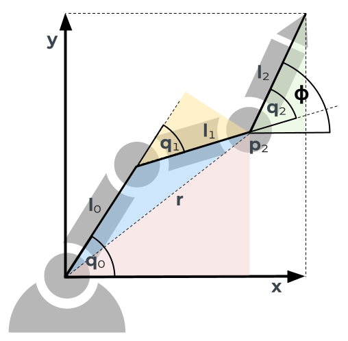

To be honest, we normally don't want our robot to tell us where it is - we want to tell where it should be. Imagine you have a GPS device and want to move to 22°13'27.8"N 22°06'55.7"E. The GPS device only tells you your position, just the coordinates, no map. You are for sure able to get to the goal position by moving in a random direction and comparing the coordinates on your device with the goal coordinates, but this would be quite inefficient. If we tell our robot to move to the goal pose (0.5, 0.1) with a rotation of 0.75, it could start moving its motors in a random direction and compare how much the current pose of the end-effector differs from the goal pose. But it would be much better if we could just compute the configuration - the joint angles - the robot will have at the goal pose and move the joints straight to this configuration.

Try it out yourself! Can you move the end-effector to (0,0) with a rotation of 0? The current pose is displayed at the bottom of the simulation.

<iframe src="https://kinematics.robotics-explained.com" title="Robot Kinematics" width="100%" height="500" frameborder="0"></iframe>

In other words, we try to find a formula which takes a pose as an input and outputs the configuration q of the robot. In forwards kinematics we developed a formula which takes the configuration as an input and outputs the pose. We therefore call this problem - you might have guessed it - *inverse kinematics* or IK for short.

Unfortunately there is no one size fits all solution. Depending on the robot, the complexity of this problem varies significantly and there are different strategies to solve it. Two major approaches are algebraic and geometric inverse kinematics. For algebraic inverse kinematics, an equation system is constructed and solved. For our planar robot we could use the three equations for the forwards kinematics and solve them for $q_0$, $q_1$ and $q_2$. These equation are

$$\phi_{O,ee} = q_0+q_1+q_2$$

$$x_{O,ee} = 0.15 \cdot cos(q_0) + 0.15 \cdot cos(q_0+q_1) + 0.03 \cdot cos(q_0+q_1+q_2)$$

$$y_{O,ee} = 0.15 \cdot sin(q_0) + 0.15 \cdot sin(q_0+q_1) + 0.03 \cdot sin(q_0+q_1+q_2)$$

However, in this article I want to show you a goemetric approach.

<iframe src="https://kinematics.robotics-explained.com?inverse" title="Robot Kinematics" width="100%" height="500" frameborder="0"></iframe>