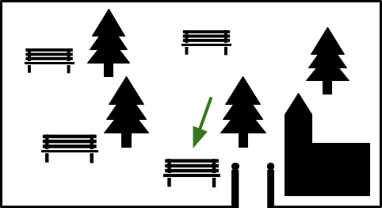
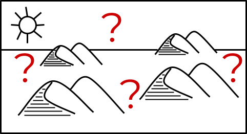
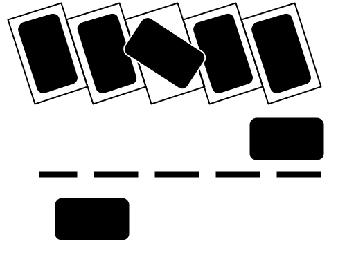

# The Cartesian space

Imagine you call your friend.  
>You: "Hey, where are you?"  
>Friend: "I'm in the park at the bench near the entrance by the church."  
>You: "Cool, I will be there in twenty minutes"  

The next day you call your robot.  
>You: "Hey, where are you?"  
>Robot: "I'm at $[0.1, 0.5, 0]^T$"  
>You: "Cool, I will be there in... Wait, where are you?"  

What happened? Robot and you don't speak the same language. In the first dialogue your friend described a position in the world based on some distinctive points. They rely on your knowledge about these points and your ability to identify them. The robot has neither the knowledge nor the sensors to be able to identify such distinctive points. But what happens if we change the scenario?

>You: "Hey, where are you?"  
>Friend: "I'm in the middle of the desert besides a grey rock near a dune."  
>You: "Cool, I will be there in... Wait, where are you?"  

In this scenario you both don't have knowledge about the region and you cannot rely on your sensors (i.e. eyes) to identify rocks and dunes correctly as they all might look similar and the environment will change in the desert due to wind and other environmental conditions.

What do you do?  
>You: "Hey, where are you?"  
>Friend: "I'm at 22°13'27.8"N 22°06'55.7"E"  
>You: "Cool, I will be there in twenty hours."  

You take a GPS device and and twenty hours later, you arrive at the said point. Great! What changed? You used the geographic coordinate system which specifies exactly each point on the surface of the earth and a device which translates its state into the language of this system.

We can talk in a similar way to robots. We take the space in which the robot can move - the *workspace* - and use a system which is able to describe every point within this space. In robotics, we often use the *Cartesian space*. This is just a fancy name for the well known coordinate system with an x- and y-axes (and z-axes in three dimensional space) we draw a thousand times in school.

# Robot poses and degrees of freedom

Within the Cartesian space we are able to name a point where the robot should move to. It is often not only important to which position the robot moves but also from which direction a robot's tool points to a position. Imagine for example a robot equipped with a drilling machine. It matters in which direction the hole is drilled, not just at which position. Or a mobile robot which should park in a parking lot. If the rotation of the robot is wrong the owners from the adjacent cars won't be amused.

We therefore use a so-called *pose* to describe how the robot is positioned. In two dimensional space the pose consists of 

* the x-coordinate
* the y-coordinate 
* an angle $\phi$ for the rotation

The end-effector cannot move without changing one of these values. If we defined our pose to consist only of the x-coordinate and the angle $\phi$, the robot could move vertically, without changing its pose. We therefore say that the two-dimensional space has three *degrees of freedom*. Things get more complicated the more dimensions we take into account. In three dimensional space we need the x-, y-, and z-coordinates as well as three angles (e.g. roll, pitch, yaw) to describe the pose: It has six degrees of freedom. The four dimensional space already has ten degrees of freedom.

# Robot kinematics

If someone would tell us "Move to 22°13'27.8"N 22°06'55.7"E" we would not be able to achieve this without a device which measures for us where we are. This is the same for the robot. GPS is too inaccurate for most tasks to determine where the tip of the end-effector is located. Imagine we have a robot which should put dishes into the dishwasher. Even an (in)accuracy of 10 cm could result in throwing dishes on the floor. Even though there exist sensors which are able to accurately measure the position of the end-effector, they are often quite expensive. But there are other solutions! For a stationary robot, e.g. a robot arm, we can compute the pose of the end-effector by taking into account the geometry of the robot and the state of the motors. This is comparable to predicting the pose of our left index finger by measuring the contraction of every muscle and the length of every bone in our body. The relationship between the geometry of the robot and its movement in the Cartesian space is called *kinematics*. Before we can dive into kinematics though, we need a tool omnipresent in robotics: *Transformation matrices*.